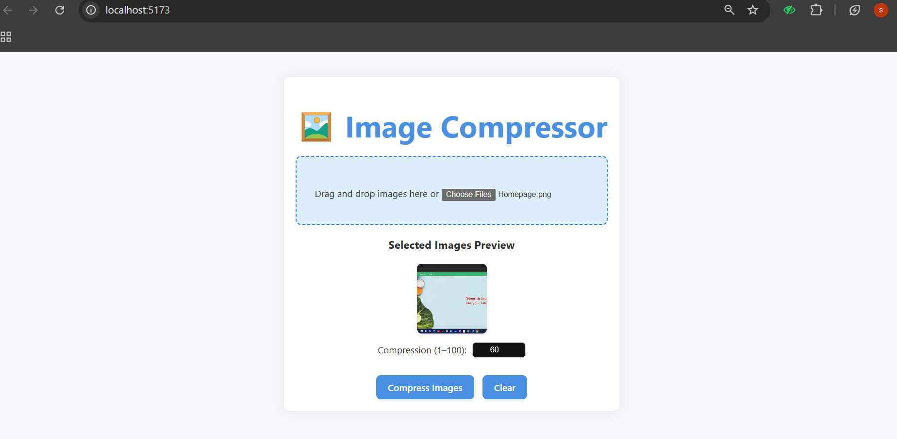
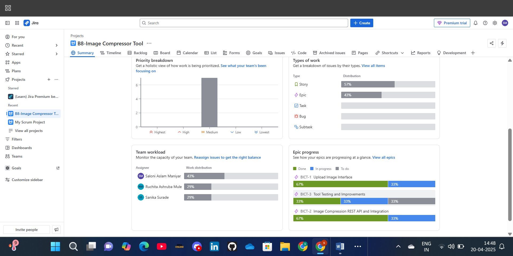
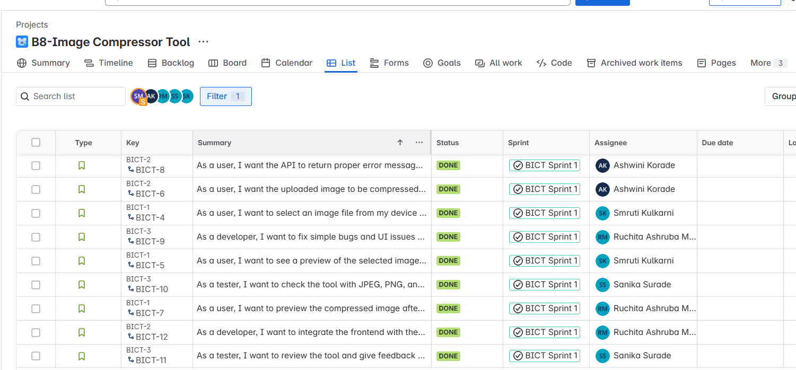
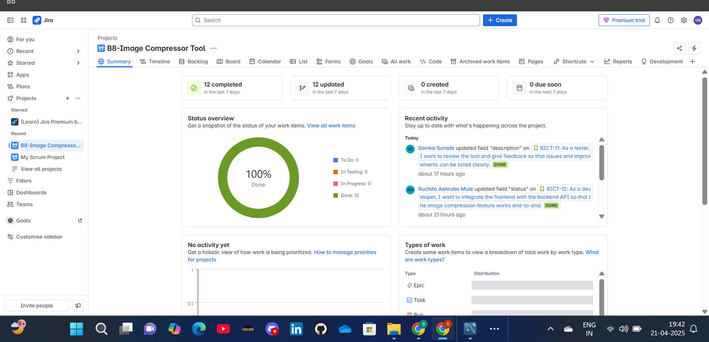
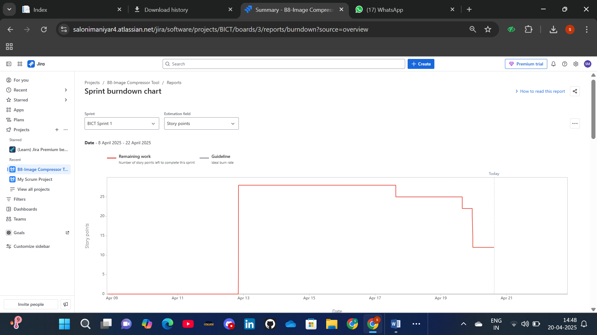
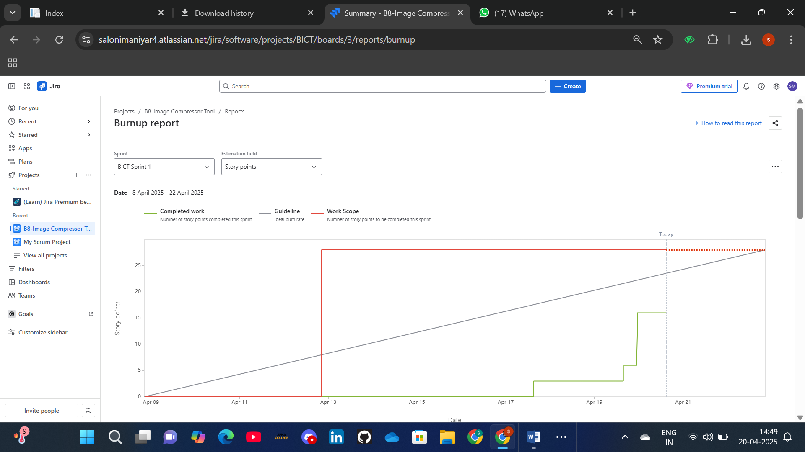
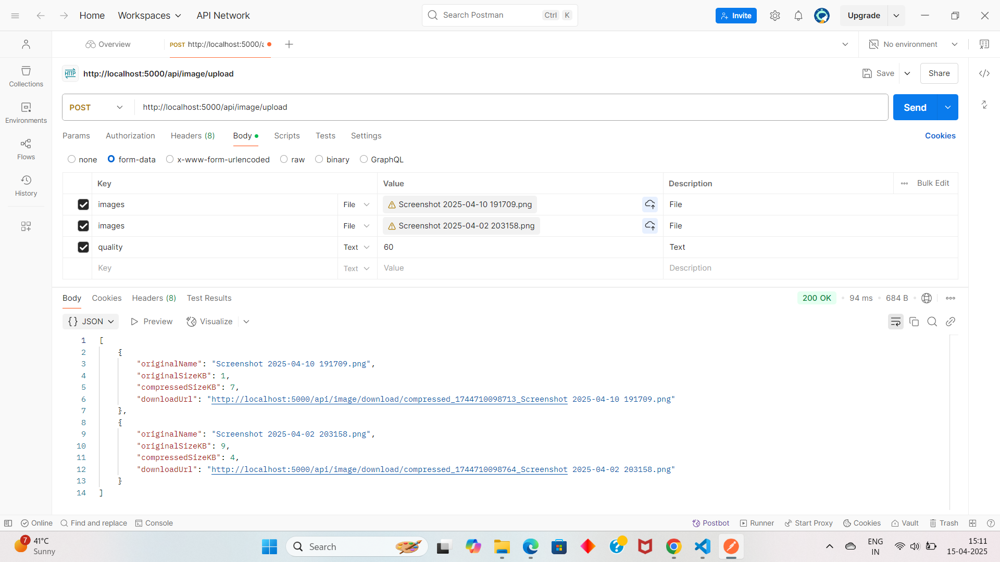
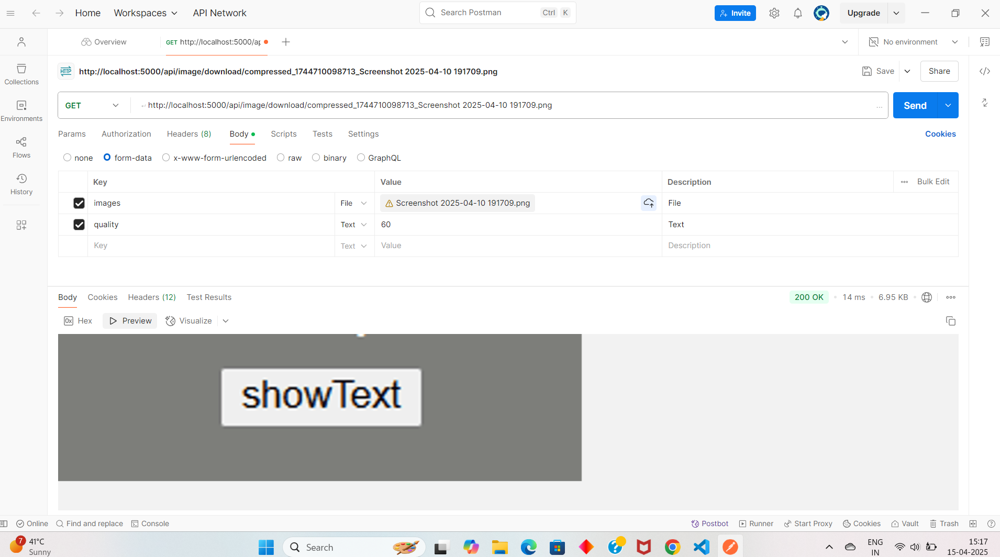
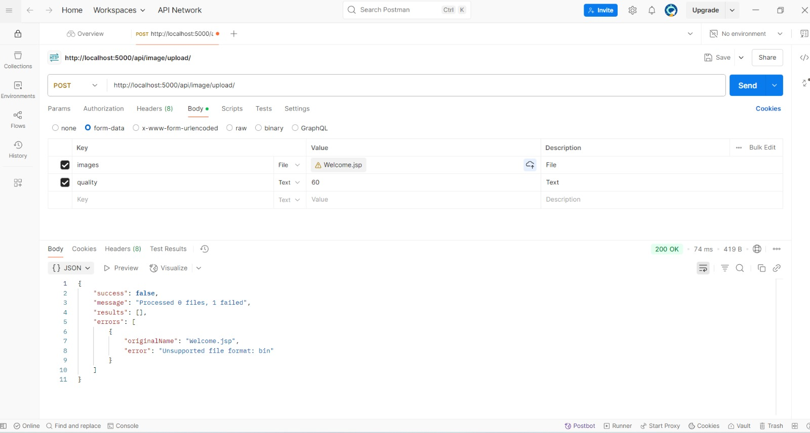

# 🖼️ Image Compressor Tool

A full-stack web application developed as part of the **Software Project Management (SPM)** subject. This tool allows users to upload and compress images. The project was developed using the **Agile Scrum** methodology with task tracking in Jira and API testing using Postman.

---

## 🚀 Features

- Upload multiple images through a user-friendly interface
- Compress images using **Sharp**
- Download the processed (compressed) image
- API tested using Postman
- Managed using Agile Scrum with daily standups and Jira board

---

## 👥 Team & Role Contributions

| Member         | Role                        | Contributions                                                                 |
|----------------|-----------------------------|-------------------------------------------------------------------------------|
| **[Saloni Maniyar]**| 🧑‍💼 Scrum Master & Team Leader | Managed Jira tasks, conducted 6 standup meetings, monitored sprint progress  |
| **Smruti Kulkarni**     | 🎨 Frontend Developer        | Created the React-based UI for image upload and result display               |
| **Ashwini Korade**    | 🔧 Backend Developer         | Built the Express.js API using Multer & Sharp for handling uploads/compression |
| **Ruchita Mule**    | 🔁 Full Stack Developer      | Connected frontend with backend, handled bug fixes and UI refinements        |
| **Sanika Surade**     | 🧪 Tester                    | Validated backend endpoints using Postman, reported and verified bug fixes   |

---

## 🛠️ Tech Stack

- **Frontend**: React (Vite)
- **Backend**: Node.js, Express.js
- **Image Processing**: [Sharp](https://www.npmjs.com/package/sharp)
- **File Upload**: [Multer](https://www.npmjs.com/package/multer)
- **MIME Type Handling**: [mime-types](https://www.npmjs.com/package/mime-types)
- **Project Management**: Jira
- **API Testing**: Postman

---

## 📦 Installation

To run this project locally:

```bash
# Backend dependencies
cd backend
npm install

# Frontend dependencies
cd ../frontend
npm install

# Start backend
npm start

# Start frontend
npm run dev
```

---

## 🖼️ Project UI & Feature Screenshots

### 📤 Upload UI  


### 🖼️ Uploaded Image Preview  


### 📉 Compression Result  


---

## 📊 Sprint & Jira Documentation

### 📌 Jira Summary  


### 📋 Issues Assigned  


### 🧾 Final Sprint Document  


### 📈 Burndown Chart  


### 📈 Burnup Chart  


---

## 🧪 Postman API Testing Screenshots

### 📤 Upload & Compress Request  


### 📥 Download Request  


### ❌ Error Handling  


---

## 📅 Sprint Summary

- 🕒 Duration: 2-week sprint
- 👨‍💼 6 team stand-up meetings held
- 🧩 All features implemented and tested
- 📌 Tools used: Jira, Postman, Google Meet

---

> This project demonstrates how Agile and Scrum methodologies can be effectively applied to manage software projects in a structured and collaborative way.
